# traffic-control-system
Car registry and Fine recording and payment simple System.

This project was developed as the requirement to pass the Structured Programming Course at Ain Shams University, Faculty of Computer Science and Information Systems.

Due to the nature of the course, the project was developed in `C++` language.

## Requirements
The project was developed using Visual Studio 2019, so it is recommended to use it to open the project. However, the project can be opened using any IDE that supports C++.

The college requirements for this course can be found in the [assets](./assets/Requirement.pdf) folder.

## Documentation
The documentation of the project is available in the [assets](./assets/Report.pdf) folder, it is thorough and explains the project in detail.

## Overview
This is a simple system that allows the registration of cars and drivers, and the recording of fines. The system also allows the payment of fines.

- Driver Operations:
  - Car registry
  - Driver registry
  - Fine payment
  - Car Search

- Police Operations:
  - Fine recording

## Screenshots
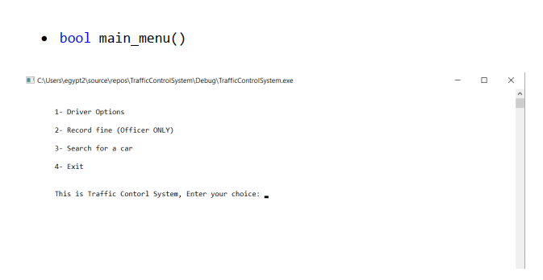
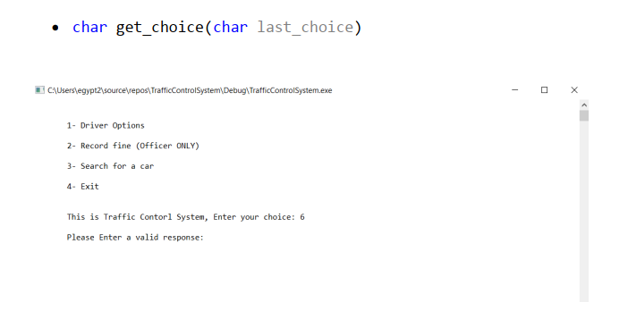
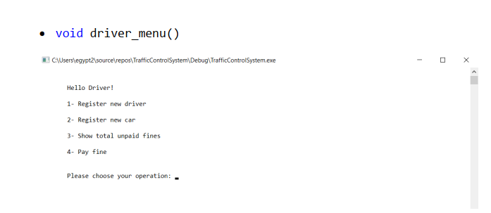
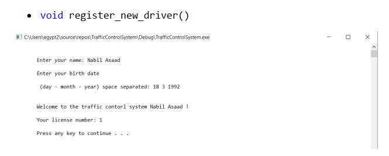
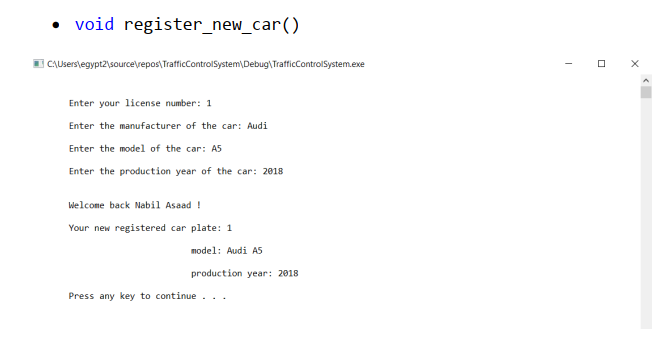
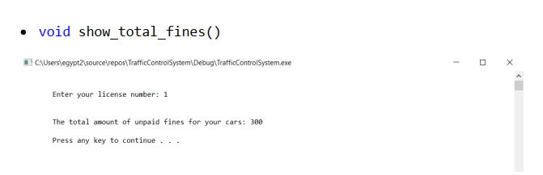
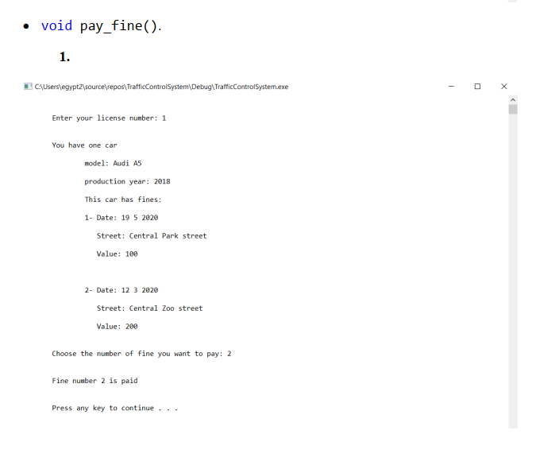
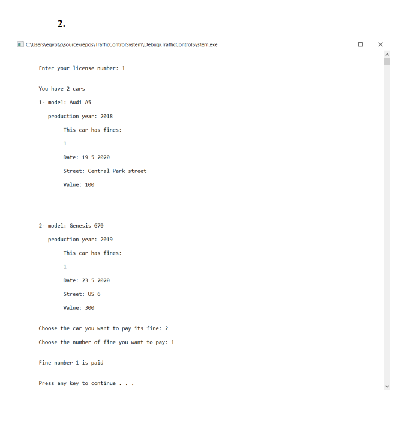
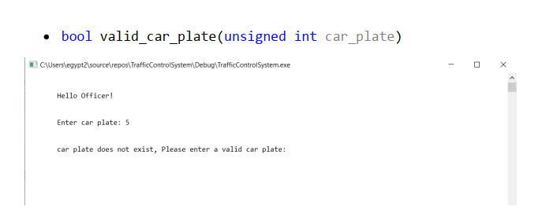
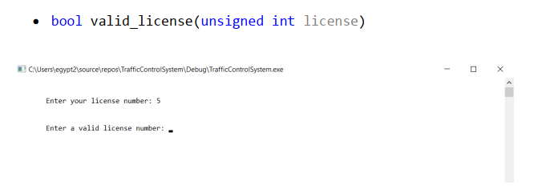
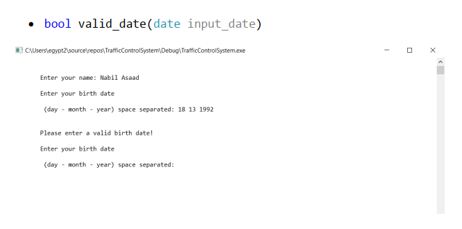
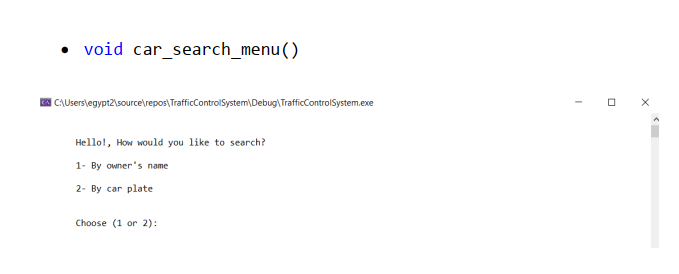
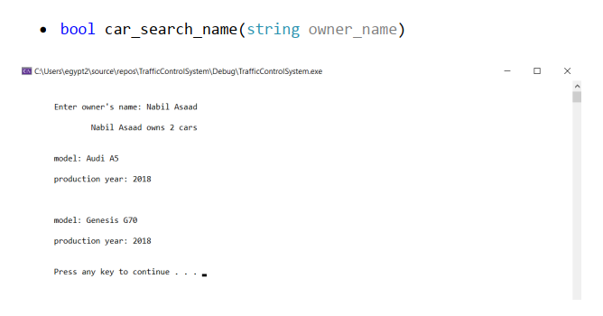
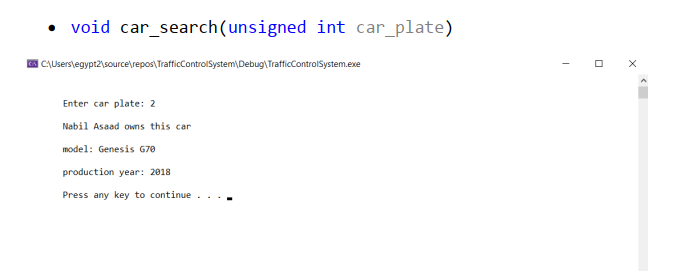
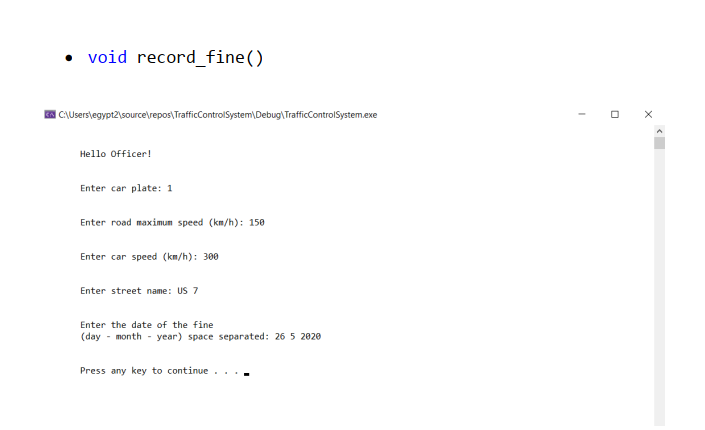
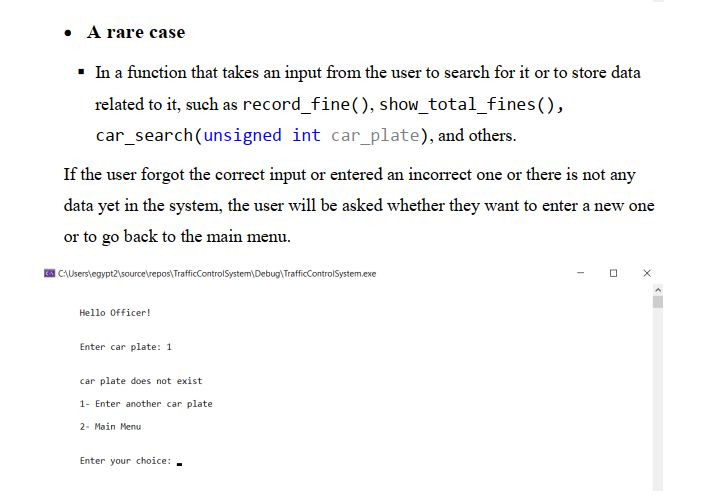
